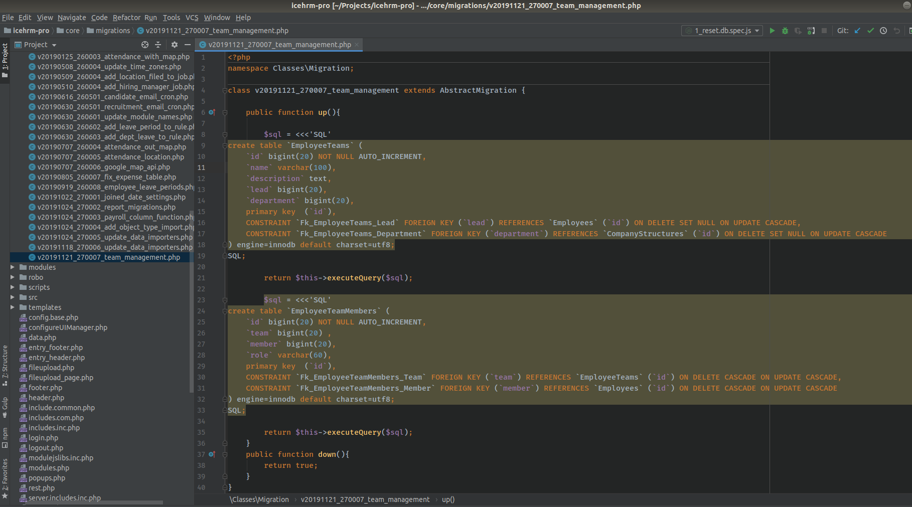
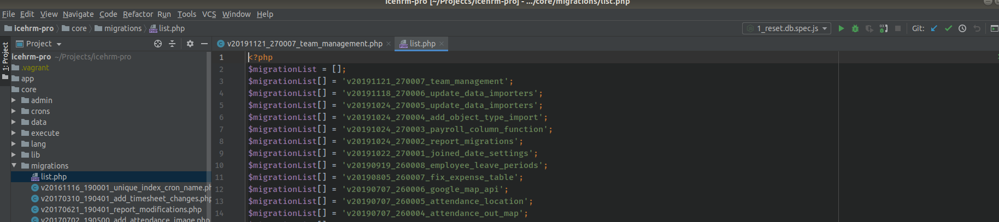
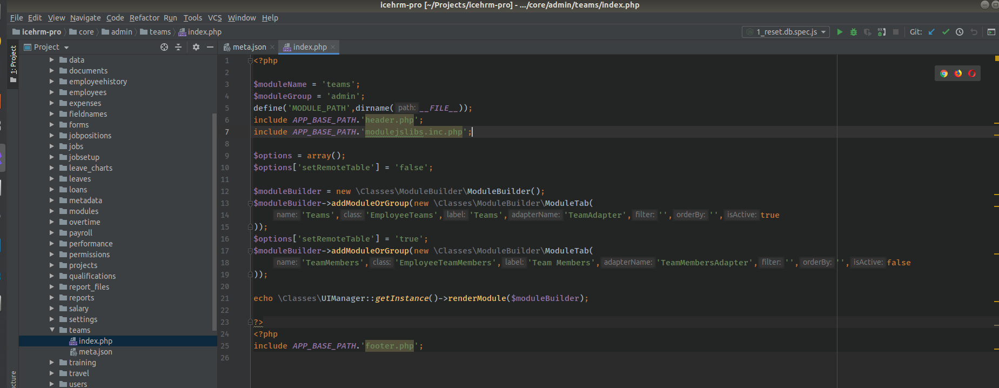
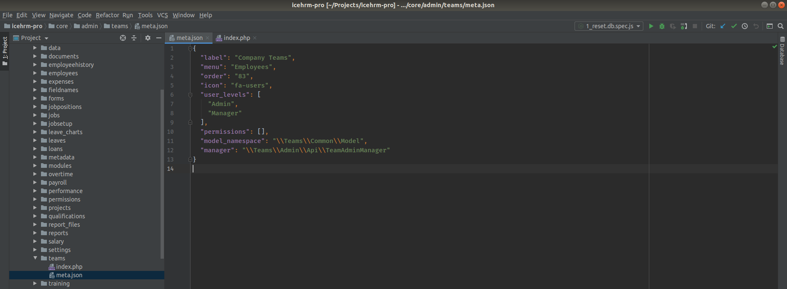
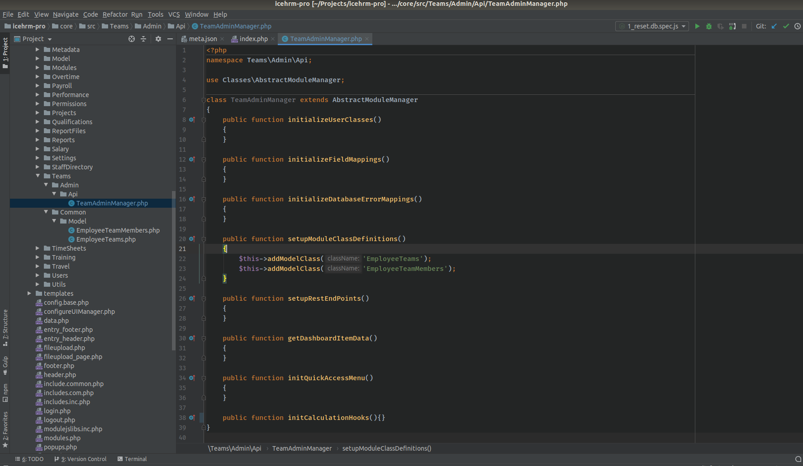
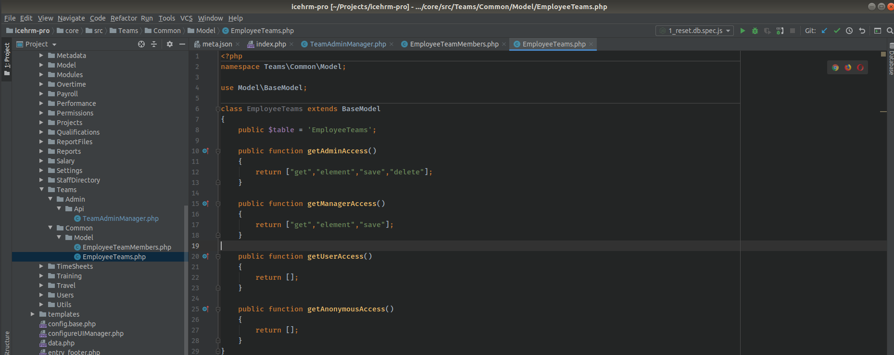
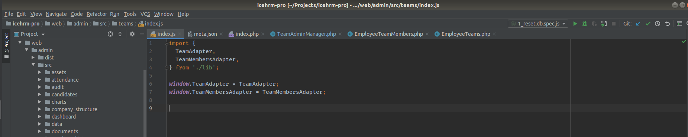
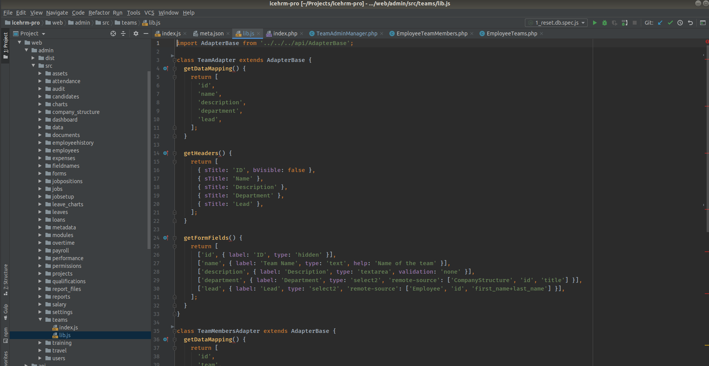
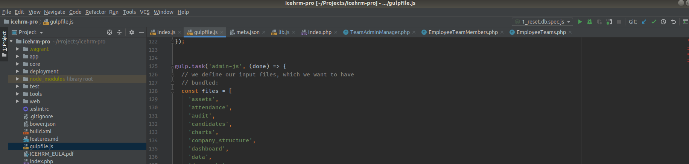
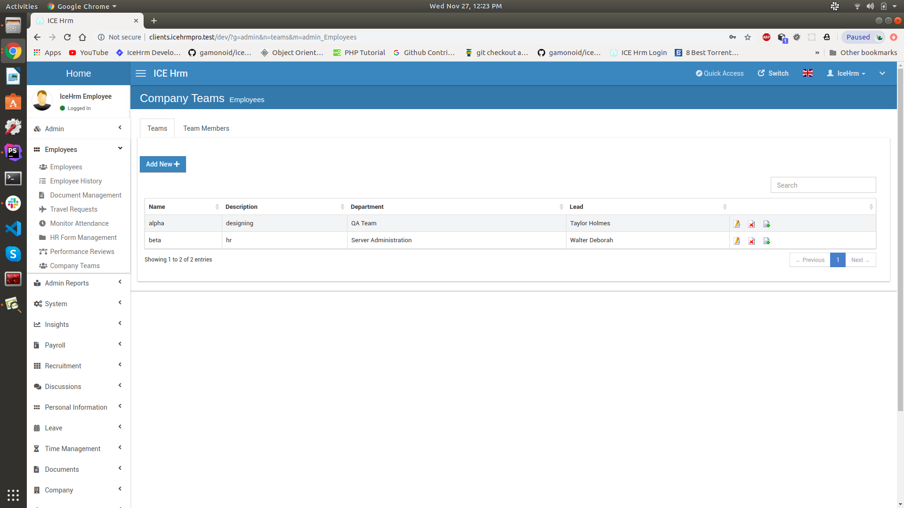

# Add new module

Adding a new module in icehrm is relatively easy. You don't have to build frontend manually, just defining them on javascript is enough.  

Let's see how to add a new module step by step.  
  
We'll create a new module named **teams** under **Employees** menu to manage teams within a company.

These changes should be done inorder to add the new module.
We'll create this module with two tabs named **Teams** and **Team Members**.
- First add a new migration at **core/migrations** to create database tables.  


  
- Add the migration on top of **list.php** inside migrations directory. Then new database tables will be automatically created.   



  
- Add the module to **core/admin** and **core/modules** (note that if a module has only admin section adding it to core/admin is enough).    

  

Edit the meta.json file. Change the menu value to **Employees** to place the module under that menu.  
 


  

- Add related classes to **core/src** (e.g For teams its core/src/Teams )


  
    


  

- Add module to **web/admin/src** and **web/modules/src** (note that if a module has only admin section adding it to web/admin/src is enough)

  
  
    


  
- Add reference to **gulpfile.js**, under **admin-js** and **module-js** tasks (note that if a module has only admin section adding it to admin-js is enough)



  
- Do a **vagrant ssh** and run gulp inside /vagrant to rebuild the frontend.
```
~ $ cd /vagrant
~ $ gulp
```

**note :** Check the log and fix if there are any errors.
  
   
   
 

 
