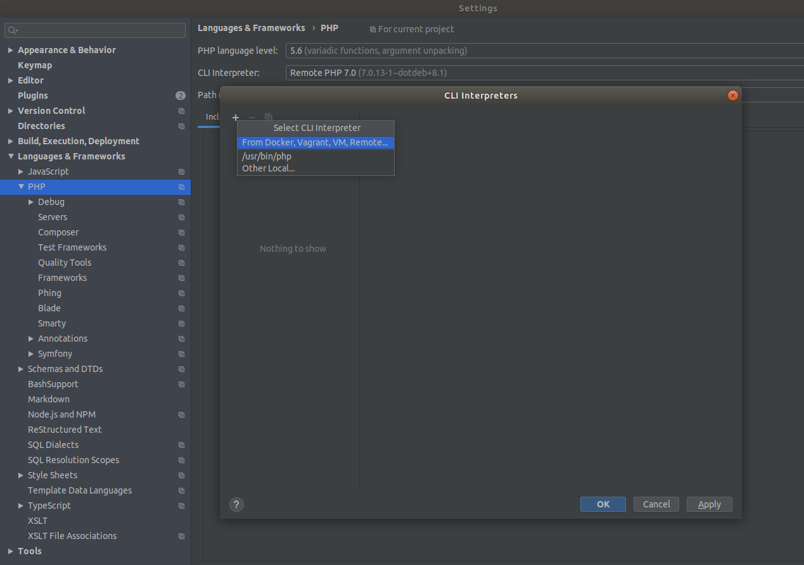
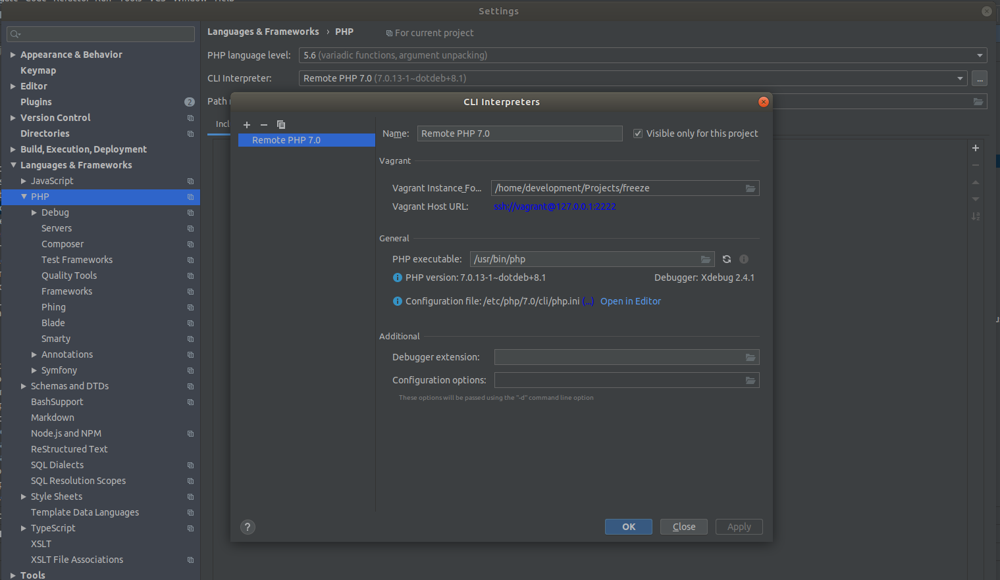
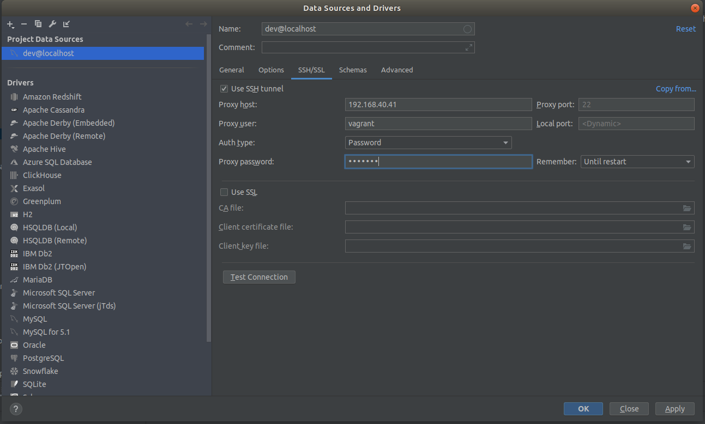

# Setup IDE(PhpStorm)

Before you start debugging, make sure that you have Xdebug installed and configured properly.

### Selecting remote interpreter

In the Settings dialog (Ctrl+Alt+S), click PHP under Languages & Frameworks.
On the PHP page that opens, click the Browse button next to the CLI Interpreter field.
Click the + and select From Docker,Vagrant,VM and Remote ...

Configure Remote PHP Interpreter dialog box opens and  we can select the Vagrant option to automatically populate connection details. In most cases, PhpStorm can also figure out the path to the PHP interpreter on the Vagrant machine. If not, we can adjust it manually.

### Setting up path mappings

Go to Servers under PHP and make sure path mappings are correctly matched as shown here.

### Installing XDebug helper for chrome
Then you need to install XDebug Helper google extension in your chrome browser. To do that, google “Xdebug Helper” and you will see a link to chrome store with the name Xdebug Helper, which is a chrome extension.

### Debugging dashboard module

Let's take a quick look at debugging dashboard module
Open /core/modules/dashboard/index.php and set a breakpoint

Then we need to enable chrome xdebug helper.

When we refresh the page code stops executing at the breakpoint we set.
Now you can debug from there.

### Connecting to development DB via PhpStorm

In the Database tool window (View -> Tool Windows -> Database), click the Data Source Properties icon.

In the Data Sources and Drivers dialog, click the + icon and select MySQL.
In the General tab provide dev as the Host,User and Password.

Then click SSH/SSL tab and put a tick on Use SSH tunnel checkbox. Provide the details 192.168.40.41 as the Proxy host. vagrant as both Proxy user and Proxy password.

Now you can test the connection. Then apply the changes.

If the tables don't load under the Schemas dropdown right click on it.
Database Tools -> Force Refresh

